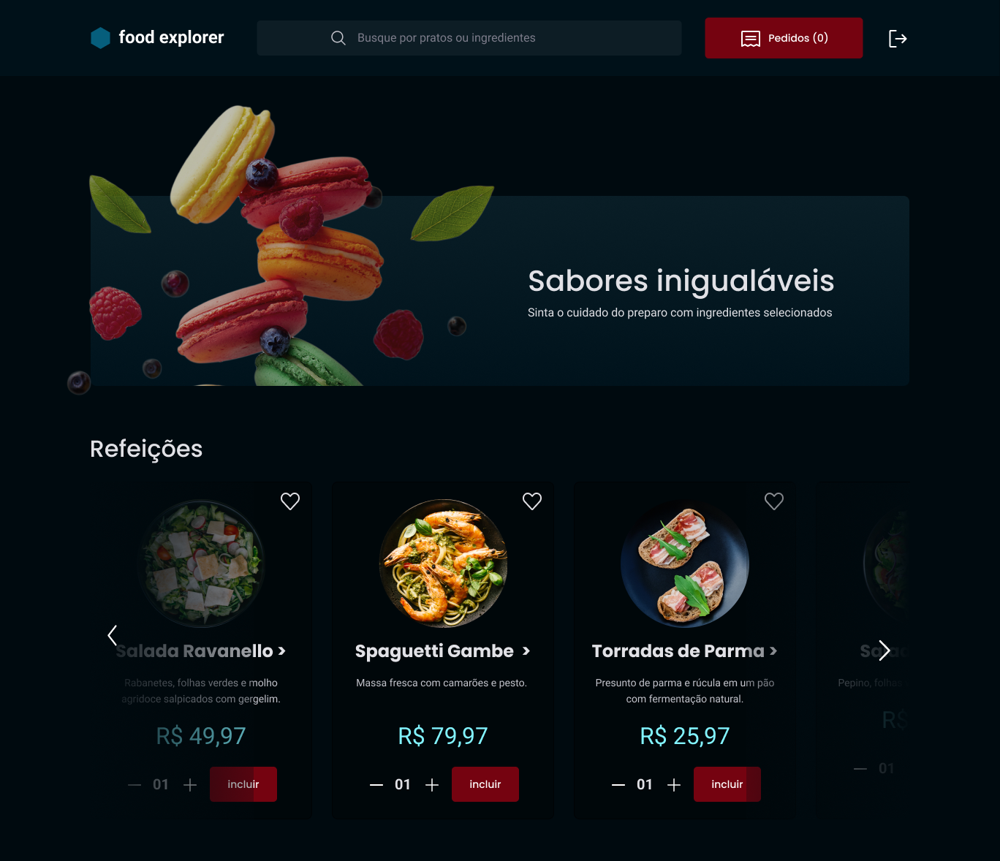

# Food Explorer

<p align="center">
  
</p>

---

**Cardápio digital para um restaurante fictício.**

O Food Explorer é um projeto desenvolvido como desafio final do programa Explorer da Rocketseat. Trata-se de uma aplicação de cardápio digital para um restaurante fictício.

---

## 📁 Projeto

O projeto Food Explorer consiste em duas partes: o front-end, responsável pela interface do usuário (disponível neste repositório), e o back-end, que gerencia a lógica e o armazenamento dos dados (disponível [aqui](https://github.com/AlbertoScholz/food-explorer-backend).

## 📃 Páginas

A aplicação conta com as seguintes páginas:

- **Login**
- **Cadastro**
- **Home**
- **Detalhes do prato**
- **Novo prato**
- **Editar prato**
- **Favoritos**



## 🛠️ Funcionalidades

A aplicação apresenta uma variedade de funcionalidades, incluindo:

- **Login e Cadastro:** Autenticação segura para administradores e usuários.
- **Gerenciamento de Pratos:** Adição, edição e remoção de pratos no cardápio.
- **Filtragem de Pratos:** Facilidade em encontrar pratos específicos.
- **Detalhes do Prato:** Informações detalhadas sobre cada prato disponível.
- **Favoritos:** Capacidade de favoritar pratos e visualizar uma lista de favoritos.
- **Carrinho de Compras:** Adição de pratos ao carrinho para posterior compra.
- **Logout:** Encerramento seguro da sessão.

## 💻 Tecnologias

Este projeto foi desenvolvido utilizando as seguintes tecnologias:

- Axios
- ReactJS
- ReactDOM
- React Icons
- React Responsive
- React Router Dom
- Styled Components
- Swiper
- ViteJS

## 💡 Utilização

A aplicação Food Explorer está disponível para uso [aqui]([https://leafy-cheesecake-a225b2.netlify.app/](https://food-explorer-frontend-a225b2.netlify.app/)). Se preferir executá-la localmente, siga as instruções abaixo:

1. Clone o projeto:

   ```bash
   git clone https://github.com/AlbertoScholz/food-explorer-frontend

    Acesse a pasta do projeto:

    bash

cd food-explorer-frontend

Instale as dependências:

bash

npm install

Inicie o servidor:

bash

    npm run dev

⚠️ Importante: Este projeto utiliza uma hospedagem gratuita para o back-end, podendo ocorrer atrasos no tempo de resposta do servidor.
👩🏾‍💻 Personas

O Food Explorer possui duas personas principais: o administrador e o usuário.

    Admin:
        E-mail: admin@email.com
        Senha: admin123
        Acesso privilegiado para gerenciar o cardápio.

    Usuário:
        E-mail: user@email.com
        Senha: user123
        Acesso restrito às funcionalidades da aplicação.

📝 Licença

Este projeto está sob a licença MIT.
